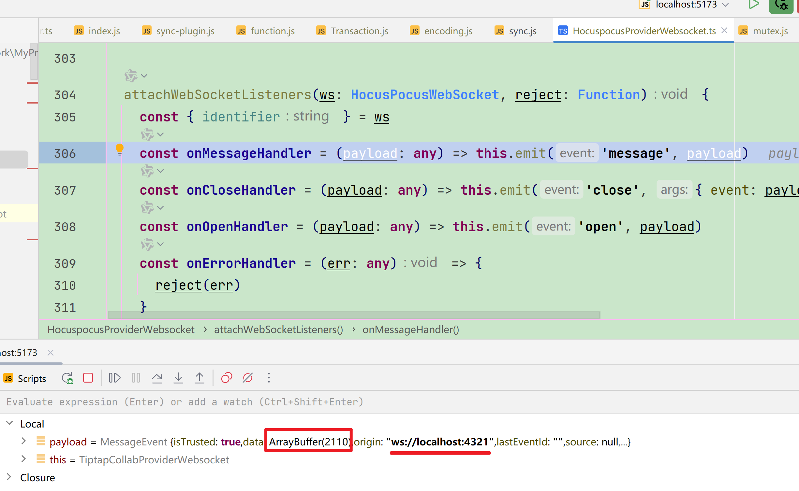

## 文档内容加载，光标自动定位到了文章末尾。怎么记忆上次位置？
谁一开始就改变了光标位置？

selectionUpdate

src/Editor.ts:364
const state = this.state.apply(transaction)
const selectionHasChanged = !this.state.selection.eq(state.selection)

transaction 改变了位置

EditorState.apply

加载前，位置是 1，加载内容后位置在末尾。

### 解决

E:\Sync\Work\MyProject\LiteNotion\lite-notion-fe\src\components\extensions\CursorMemo\index.ts
onSelectionUpdate

监听到ws消息
